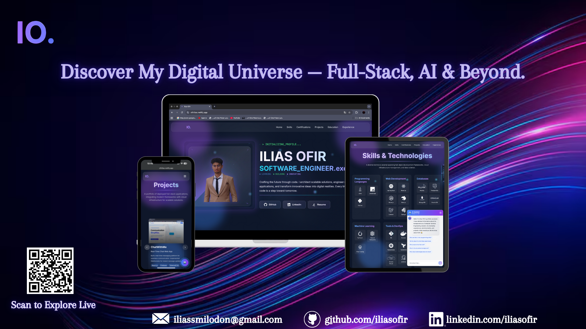

# Portfolio 2025 - Ilias Ofir



> A modern, interactive portfolio showcasing my journey as a Full Stack Developer with stunning quantum-inspired animations and a futuristic design.

## 🚀 Overview

This is my personal portfolio website built with cutting-edge web technologies. It features a sleek, futuristic interface with quantum-inspired visual effects, smooth animations, and an interactive AI chatbot assistant.

## ✨ Key Features

- **Quantum-Inspired Design** - Beautiful animated backgrounds with neural networks and particle effects
- **Interactive HUD System** - Real-time system monitoring display with hover interactions
- **AI Chatbot** - Integrated intelligent assistant powered by OpenAI AI
- **Responsive Design** - Fully optimized for desktop and mobile devices
- **Dark/Light Theme** - Theme switching capability with smooth transitions
- **Smooth Animations** - Powered by Framer Motion for fluid user experience
- **Project Showcase** - Interactive project cards with detailed information
- **Experience Timeline** - Visual representation of professional journey
- **Skills Display** - Comprehensive overview of technical expertise

## 🛠️ Built With

- **React** - UI library for building interactive interfaces
- **Vite** - Next-generation frontend tooling
- **Framer Motion** - Animation library for smooth transitions
- **TailwindCSS** - Utility-first CSS framework
- **React Router** - Client-side routing
- **OpenAI AI** - Intelligent chatbot integration

## 🚦 Getting Started

```bash
# Install dependencies
npm install

# Start development server
npm run dev

# Build for production
npm run build

# Preview production build
npm run preview
```

## 📱 Responsive Features

- **Desktop**: Full HUD system with fan-style navigation menu
- **Mobile**: Optimized interface with touch-friendly interactions
- **Adaptive Layouts**: Content automatically adjusts to screen size

## 🎨 Design Highlights

- Glassmorphism UI elements
- Animated quantum particle fields
- Neural network visual effects
- Holographic card designs
- Custom cursor interactions
- Smooth scroll animations

## 📄 License

© 2025 Ilias Ofir. All rights reserved.

---

**Live Demo**: [https://ofirilias.netlify.app/]

**Contact**: iliassmilodon@gmail.com
